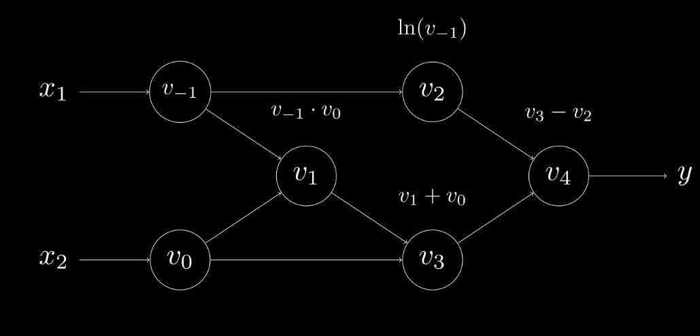

## **2. What AD Is Not ?**
Without a clear introduction, many people place automatic differentiation (AD) in the same category as numerical differentiation or symbolic differentiation. This confusion is understandable because AD delivers numerical values for derivatives while using the rules of symbolic calculus, yet it only stores the resulting numbers rather than the complete algebraic expressions. This dual character means AD operates in a space that overlaps both approaches (Griewank, 2003). To start, we will explain how AD differs from those two familiar methods and in many respects exceeds their capabilities.

### **2.1 AD Is Not Numerical Differentiation**
Numerical differentiation estimates a derivative by applying finite difference formulas to function values sampled at specific points (Burden & Faires, 2001). At its core, the method springs directly from the limit definition of the derivative. For example, for a multivariate function $f∶R^n→R$, one can approximate the gradient $(\frac{∂f}{∂x_1 },…,\frac{∂f}{∂x_n})$ using:

$$\frac{∂f(x)}{∂x_i} \approx \frac{f(x+he_i )-f(x)}{h}\text{ (Eq.1)}$$

where $e_i$ is the $i$-th unit vector and $h>0$ is a small step size. Its main upside is simplicity of implementation; the downsides are that computing a gradient in $n$ dimensions needs $O(n)$ separate evaluations of $f$ and that you must choose the step size $h$ with great care.

Approximating derivatives numerically is fundamentally unstable and suffers from poor conditioning, except when using complex variable techniques that apply only to certain holomorphic functions (Fornberg, 1981). This instability arises from truncation errors and round off errors introduced by finite computational precision and the selection of the step size $h$. While the truncation error vanishes as $h$ approaches zero $(h→0)$, reducing $h$ increases the round off error until it becomes the primary source of inaccuracy.

Various methods have been proposed to reduce the approximation error in numerical differentiation. For example, using a central difference formula:

$$ \frac{∂f(x)}{∂x_i} \approx \frac{f(x+he_i )-f(x-he_i)}{2h} + O(h^2 )\text{ (Eq.2)}$$

in which the leading order errors cancel out, pushing the truncation error from first order to second order in $h$. In one dimension, this central difference (Eq. 2) is just as expensive as the forward difference (Eq. 1) because both require two evaluations of $f$. But in higher dimensions the cost grows quickly: forming the full Jacobian of a map $f∶R^n→R^m$ using central differences demands $2mn$ function evaluations, forcing a trade off between accuracy and computational expense.

Advanced approaches to enhance numerical differentiation, such as higher order finite difference schemes, Richardson extrapolation toward the limit (Brezinski & Zaglia, 1991), and weighted sum differential quadrature methods (Bert & Malik, 1996), all raise computational cost, never fully remove approximation errors, and remain highly vulnerable to floating point truncation. Moreover, the $O(n)$ expense of computing an $n$-dimensional gradient makes numerical differentiation impractical for machine learning, where $n$ can reach millions or billions in cutting edge deep networks (Shazeer et al., 2017). By contrast, deep learning models tolerate approximation errors reasonably well thanks to their intrinsic resilience to numerical noise (Gupta et al., 2015).

### **2.2 AD Is Not Symbolic Differentiation**

Symbolic differentiation refers to the automated transformation of mathematical expressions to derive their exact derivative formulas (Grabmeier and Kaltofen, 2003). This is achieved by systematically applying differentiation rules, for example:

$$ \frac{d}{dx}(f(x)+g(x)) \approx \frac{d}{dx}(f(x)) + \frac{d}{dx}(g(x))\text{ (Eq.3)}$$

$$ \frac{d}{dx}(f(x)g(x)) \approx (\frac{d}{dx}(f(x)))g(x) + f(x)(\frac{d}{dx}(g(x)))\text{ (Eq.4)}$$

When mathematical formulas are stored as structured data, differentiating an expression tree by symbolic means becomes a fully mechanical task, an idea that dates back to the earliest days of calculus (Leibniz, 1685). Today, this approach is implemented in computer algebra systems like Mathematica, Maxima, and Maple, as well as in machine learning libraries such as Theano.

In optimization, symbolic derivatives can reveal the underlying structure of a problem and sometimes even yield closed-form solutions for extrema( such as solving for $\frac{d}{dx} f(x)=0$) bypassing the need for further derivative evaluations. However, symbolic derivatives often expand into expressions that grow exponentially in size compared to the original formula, making them impractical for efficient runtime computation of derivative values.

Take the function $h(x)=f(x)h(x)$ and apply the product rule. Both $h(x)$ and its derivative $(\frac{d}{dx} h(x))$ share the subexpressions $f(x)$ and $g(x)$. On the derivative’s right hand side, the terms $f(x)$ and $\frac{d}{dx} f(x)$ appear separately. If you immediately expand $\frac{d}{dx} f(x)$ by plugging in its symbolic derivative, you duplicate every computation common to $f(x)$ and $\frac{d}{dx} f(x)$. Repeating this process without optimization causes the symbolic representation to grow exponentially, making evaluation extremely slow. This issue is called expression swell.

When our focus is on obtaining accurate numerical derivatives rather than preserving their symbolic representations, we can greatly reduce computational effort by storing only the numerical values of intermediate sub expressions. To make this even more efficient, we interleave differentiation and simplification at each step. This concept is the foundation of automatic differentiation: at every elementary operation, perform the symbolic differentiation while simultaneously tracking and storing the numerical results alongside the primary function’s computation. This procedure defines forward mode AD, which we will discuss in the next section.

## **3. What is Autodiff and type of Autodiff ?**
### **3.1 What is Autodiff ?**

Automatic differentiation can be viewed as an alternative way to execute a program in which the original calculations are extended to include derivative computations. Every numerical routine ultimately breaks down into a finite collection of basic operations whose derivatives are known (Verma, 2000; Griewank and Walther, 2008). By applying the chain rule to combine the derivatives of these basic operations, one obtains the derivative of the entire composite function. Common basic operations include addition, subtraction, multiplication, division, the sign operation, and transcendental functions such as exponentials, logarithms, and trigonometric functions.

To implement this, we can leverage an evaluation trace. An evaluation trace is a special table that keeps track of intermediate variables as well as the operations that created them. Every row corresponds to an intermediate variable and the elementary operation that caused it. These variables, called primals, are typically denoted $v_i$ for functions $f:R^n→R^m$ and follow these rules:

- Input variables: $v_{i-n}=x_i,i=1,…,n$
- Intermediate variables: $v_i,i=1,…,l$
- Output variables: $y_{m-i}=v_{l-i}  ,i=m-1,…,0$

Example:

$$y=f(x_1,x_2 )=x_1 x_2+x_2-ln⁡(x_1 )\text{ (Eq.5)}$$
$$x_1=2,x_2=4$$

| **Forward Primal Trace** | **Output** |
| -------- | ------- |
| $v_{-1}=x_1$ | 2 |
| $v_{0}=x_2$ | 4 |
| $v_1=v_{-1} \times v_0$ | 2 x (4) = 8 |
| $v_2=ln⁡(v_{-1})$ | ln(2) = 0.693 |
| $v_3=v_1+v_0$ | 8 + 4 = 12 |
| $v_4=v_2-v_3$ | 12 – 0.693 = 11.307 |
| $y=v_4$ | 11.307 |

Table 1: Forward Primal Trace

Figure 1: Computation Graph

Evaluation traces are fundamental to automatic differentiation. Unlike symbolic differentiation, which is restricted to closed form expressions, AD can also handle algorithms that include branching, loops, recursion, and function calls. This flexibility stems from the fact that any numerical program execution generates a trace of concrete input, intermediate, and output values. Those values alone suffice to calculate derivatives via repeated application of the chain rule, regardless of which control flow path the code followed. In other words, AD disregards any operations, such as conditionals or loop controls, that do not directly affect numerical values.

### **3.2 Forward Mode**

Forward mode AD builds on the idea of an evaluation trace by pairing each primary value $v_i$ with a corresponding tangent $\dot{v_i}$.These tangents capture the partial derivative of each primary value with respect to the chosen input variable.

Referencing back to eq. 5, we'd have the following definition of tangents if we were interested in finding $\frac{∂y}{∂x_2 }$:

$$ \dot{v_i} = \frac{∂v_i}{∂x_2} $$

Continuing from this definition, we can build out the forward primal and forward tangent trace to compute $\frac{∂y}{∂x_2}$ when $x_1=3,x_2=-4,\dot{x_1}=\frac{∂x_1}{∂x_2}=0$, and $\dot{x_2}=\frac{∂x_2}{∂x_2}=1$.

| Forward Primal Trace | Output | Forward Tangent Trace                       | Output           |
|----------------------|--------|---------------------------------------------|------------------|
| $v_{-1} = x_1$       | 3      | $\dot v_{-1} = \dot x_1$                    | 0                |
| $v_{0} = x_2$        | –4     | $\dot v_{0} = \dot x_2$                     | 1                |
| $v_{1} = v_{-1} \times v_{0}$ | $3 \times (-4) = -12$ | $\dot v_{1} = \dot v_{-1}\,v_{0} + \dot v_{0}\,v_{-1}$ | $0\times(-4) + 1\times(3) = 3$ |
| $v_{2} = \ln(v_{-1})$| $\ln(3)=1.10$ | $\dot v_{2} = \dot v_{-1}\times\frac{1}{v_{-1}}$ | $0\times\frac1{3}=0$ |
| $v_{3} = v_{1} + v_{0}$ | $-12 + -4 = -16$ | $\dot v_{3} = \dot v_{1} + \dot v_{0}$ | $3 + 1 = 4$ |
| $v_{4} = v_{2} - v_{3}$ | $-16 - 1.10 = 17.10$ | $\dot v_{4} = \dot v_{2} - \dot v_{3}$ | $0 - 4 = -4$ |
| $y = v_{4}$ | $-17.10$ | $\dot y = \dot v_{4}$ | $-4$ |

Table 2: Forward Mode Trace

This process is the essence of forward mode AD. At every elementary operation for a given function, compute intermediate variables (primals) by applying basic arithmetic operations, and in synchrony, compute their derivatives (tangents) by using what we know from Calculus.

With this approach, we can do more than just compute derivatives, but we can compute Jacobians. For a vector-valued function $f:R^n→R^m$, we choose **a** set of inputs **a** ∈ $R^n$ where **x=a** and tangents $\dot{x}=e_i$ for $i=1,…,n$. Applying these inputs to our function in forward mode now generates the partial derivatives of the all output variables $y_j$ for $j=1,…,m$ with respect to single input variable $x_i$. Essentially, every forward pass in forward mode AD generates one column of the Jacobian—correlating to the partial derivatives of all outputs with respect to a single input.

Jacobian Matrix:

$$
J =
\begin{pmatrix}
\displaystyle \frac{\partial y_{1}}{\partial x_{1}} & \cdots & \displaystyle \frac{\partial y_{1}}{\partial x_{n}} \\
\vdots & \ddots & \vdots \\
\displaystyle \frac{\partial y_{m}}{\partial x_{1}} & \cdots & \displaystyle \frac{\partial y_{m}}{\partial x_{n}}
\end{pmatrix}
$$

Because the function $f∶R^n→R^m$ has $n$ inputs and one forward pass in forward mode generates a column of the Jacobian, it requires $O(n)$ evaluations to compute the full $m×n$ Jacobian matrix. If you don't recall from Linear Algebra, the full Jacobian represents the partial derivatives of all outputs with respect  to all inputs; for our purposes, the gradients we're trying to derive for optimization.

This feature generalizes to the Jacobian-vector product (JVP). JVPs are the dot-product between the Jacobian of a function **J** ϵ $R^{m×n}$, and a column vector **r** ϵ $R^n$. The result of the dot product returns a $m$-dimensional column vector encoding the change of the outputs when the inputs are perturbed. In better words, it describes the change in the outputs when the inputs are directionally nudged by **r**.

What makes this special, specifically in forward mode AD, is that we don't need to compute the full Jacobian. By choosing a set of inputs, and setting the perturbation vector **r** one evaluation in forward mode for a function outputs the JVP without ever computing the entire Jacobian.

Jacobian-vector Product:

$$
J \cdot \mathbf{r}
=
\begin{bmatrix}
\frac{\partial y_1}{\partial x_1} & \cdots & \frac{\partial y_1}{\partial x_n} \\
\vdots & \ddots & \vdots \\
\frac{\partial y_m}{\partial x_1} & \cdots & \frac{\partial y_m}{\partial x_n}
\end{bmatrix}
\;\cdot\;
\begin{bmatrix}
r_1 \\ \vdots \\ r_n
\end{bmatrix}
$$

Altogether, this makes forward mode AD practical in certain cases. To be specific, forward mode AD is effective when evaluating a function $f∶R^n→R^m$ when $n≪m$. For example, a function with one input and $m$ outputs requires a single forward pass in this mode to compute its Jacobian. On the opposite end, a function with $n$ inputs and one output ( $f∶R^n→R$ ) requires $n$ forward passes in forward mode to obtain its Jacobian.

This case is important to examine because, oftentimes, the parameters of a neural network represent $R^n$ while the scalar loss—caused by the model's parameters—represents $R$. Thus, if we were to use forward mode AD for gradient-based optimization, we'd be using it when it's suboptimal.

Wrapping up, forward mode AD is preferred over numeric and symbolic differentiation because it doesn't have issues like numerical instabilities or expression swell (see the Truncation vs. Round-off Error depiction and the Expression Swell example). But since it lacks the scalability we need for neural network optimization, we can pivot to AD's second mode, reverse mode.

### **3.2 Reverse Mode**

Arriving at this point, we have reverse mode AD—alike forward mode, yet different methodically. We begin by defining adjoints $\bar{v_i}$ representing the partial derivative of an output $y_j$ with respect to an intermediate variable $v_i$ for a function $f∶R^n→R^m$ where $i=1,…,n$ and $j=1,…,m$. We can formally define the adjoints as:

$$ \bar{v_i} =  \frac{∂y_j}{∂v_j}$$

In reverse mode AD, we perform the forward pass by applying elementary operations to compute intermediate variables, but during this stage, adjoints are not computed alongside their primal counterparts like we observed with the tangents in forward mode AD. Rather, any dependencies required for the derivative computation of $\bar{v_i}$ are stored in the computational graph.

Progressing, we use our familiarity with the derivatives of elementary operations, the chain rule, and the cached dependencies (from the forward pass) to compute the adjoints. Adjoints are computed in the order starting from an output variable and ending with all input variables that caused the output variable. This stage is commonly referred as the reverse pass. If you couldn't tell already, the "reverse" pass is what gives this mode of AD its name—in which derivatives are computed in a reversed fashion.

With intuition behind reverse mode AD, let's take a look at the reverse mode evaluation trace of eq.5 using the same values for the input variables from the Forward Mode Trace.

| Forward Primal Trace          | Output           | Reverse Adjoint Trace                                                   | Output                |
|-------------------------------|------------------|---------------------------------------------------------------------------|-----------------------|
| $v_{-1} = x_{1}$              | $3$              | $\bar v_{-1} = \bar x_{1} = \bar v_{2}\times\frac{1}{v_{-1}} + \bar v_{1}\times v_{0}$ | $-1 \times (1/3) + 1 \times (-4) = -4.33$ |
| $v_{0} = x_{2}$               | $-4$             | $\bar v_{0} = \bar x_{2} = \bar v_{3}\times 1 + \bar v_{1}\times v_{-1}$         | $1 \times 1 + 1 \times 3 = 4$            |
| $v_{1} = v_{-1} \times v_{0}$ | $3 \times (-4) = -12$ | $\bar v_{1} = \bar v_{3}\times 1$                                         | $1 \times 1 = 1$                       |
| $v_{2} = \ln(v_{-1})$         | $\ln(3) = 1.10$  | $\bar v_{2} = \bar v_{4}\times -1$                                        | $1 \times -1 = -1$                     |
| $v_{3} = v_{1} + v_{0}$       | $-12 + -4 = -16$ | $\bar v_{3} = \bar v_{1} + \bar v_{4}\times 1$                              | $1 \times 1 = 1$                       |
| $v_{4} = v_{2} - v_{3}$       | $-16 - 1.10 = 17.10$ | $\bar v_{4} = \bar y$                                                     | $1$                                    |
| $y = v_{4}$                   | $-17.10$         | $\bar y = \bar v_{4}$                                                       | $1$                                    |                                                                                          | 1                             |

Table 3: Reverse Mode Trace

In this particular trace, we start with the adjoint $\bar{y}=\frac{∂y}{∂y}=1$ and send it down to any of its dependencies (variables that caused it) by applying the derivative rules. Eventually, any input variable $x$ that contributed to the output $y$ will have its adjoint populated.

You might be confused by the computation of $\bar{v}_{-1}$ and $\bar{v}_{0}$. This is slightly unintuitive in my opinion, but since their primals contribute to the output $y$ through multiple paths—seen in the computation of $v_2$ and $v_1$ —they'll each have two incoming derivatives. We don't discard any derivative information, favoring one over the other, because we'd lose how $x_1$ and $x_2$ influence $y$. Instead, we accumulate their respective derivatives. In doing so, the total contribution of $x_1$ and $x_2$ are contained in their adjoints $\bar{x}_{1}$ and $\bar{x}_{2}$.

As seen in forward mode, Jacobians can also be computed for vector-valued functions $f∶R^n→R^m$. By choosing inputs **a** ∈ $R^n$, assigning **x=a**, and setting $\bar{y}=e_j$ for $j=1,…,m$ each reverse pass generates the partial derivative of the $j$-th output with respect to all input variables $x_i$ for $i=1,…,n.$ Because there's $m$ rows, and each reverse pass computes a row of the Jacobian, it would require $m$ evaluations in reverse mode AD to achieve the full Jacobian of $f$.

Expanding on above, we can compute the vector-Jacobian product (VJP). The VJP is the left multiply of a transposed row vector $r^T  ϵ R^{1×m}$, often referred as the cotangent vector and the Jacobian of a function **J** ϵ $R^{m×n}$. The computation of the VJP generates a $n$-dimensional row vector containing the partial derivatives of an output with respect to all its inputs when perturbed by $r^T$.

Vector-Jacobian Product:

$$
\mathbf{r}^T \cdot J
=
\begin{matrix}
(r_1 & \cdots & r_n)^T
\end{matrix}
\cdot
\begin{pmatrix}
\displaystyle \frac{\partial y_1}{\partial x_1} & \cdots & \displaystyle \frac{\partial y_1}{\partial x_n} \\
\vdots & \ddots & \vdots \\
\displaystyle \frac{\partial y_m}{\partial x_1} & \cdots & \displaystyle \frac{\partial y_m}{\partial x_n}
\end{pmatrix}
$$

Vector-Jacobian Product (Alt. Form):

$$
J^T \,.\mathbf{r}
=
\begin{pmatrix}
\displaystyle \frac{\partial y_1}{\partial x_1} & \cdots & \displaystyle \frac{\partial y_m}{\partial x_1} \\
\vdots & \ddots & \vdots \\
\displaystyle \frac{\partial y_1}{\partial x_n} & \cdots & \displaystyle \frac{\partial y_m}{\partial x_n}
\end{pmatrix}
\cdot
\begin{pmatrix}
r_1 & \cdots & r_n
\end{pmatrix}^T
$$

VJPs tie directly into optimizing neural networks because we can represent **J** as the partial derivatives of a model's outputs with respect to its inputs and $r^T$ as the partial derivatives of an objective loss function's output with respect to the model's outputs. Applying the VJP under this context produces the gradients needed for optimization. Also, like JVPs, VJPs don't require the full Jacobian of a function and can be computed in a single reverse pass.

Rounding off what we've discussed with reverse mode AD, it requires a single reverse pass to compute the gradients of an output with respect to all inputs and m reverse passes when computing such for $m$ outputs. Because of these properties, reverse mode AD is best utilized when $n≫m$. As a matter of fact, this makes reverse mode optimal for optimizing neural networks. It would only require one reverse pass to compute the gradients of a scalar producing loss function with respect to the $n$-parameters of a model influencing it; recall the case of $f∶R^n→R$.

All things considered, reverse mode AD is clearly the best option for gradient-based optimization. We only need one reverse pass for one step of gradient descent, with the addition of added memory—an acceptable trade-off given we favor time over space.

